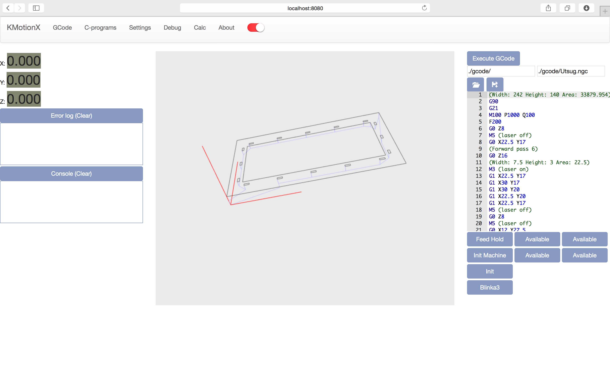

KMotionX
========

Linux/Unix (Mac OS X ) port of Dynomotions KMotion

KMotionX is more of a patch than a port of KMotion (Except for KMotionServer). The goal has been to make as small modifications as possible to the orginal source. This will make it easier to keep up with every new release.
    Builds with at least gcc-4.7 on linux and Visual Studio 2008 on windows.


See it in action on youtube
https://www.youtube.com/watch?v=oPTJwcre0hA


KMotionX also includes a JNI binding to use expose the GCodeInterpreter and KMotionDLL API to the Java world. See advanced.

####Who might be interested in this.
Anyone that would like to operate their KFlop controlled machine from their phone, tablets or anything with a web browser. I have ported the KMotionServer, KMotionDLL and GCodeInterpreter. I had plans to create a Java GUI but have now dropped that idea and created a HTML5 web application for that purpose. Drag an svg file into browser window and it will instantly be converted into executable GCode. Although I must admit it is still in alpha. There are lots of missing features to just use it out of the box. Some things might be hard wired for my current machine setup. Hence in this stage you might have to do some changes yourself. Or just wait until I have fixed it.





#####Changes from original source
- Source code for KMotionDLL and GCodeInterpreter has been patched with "ifdef" directives.(I know it is a bit ugly)
- Changed include directives to build on case sensitive file systems #include "stdafx.h" to "StdAfx.h"
- Implemented thread handling to make use of Posix instead of Windows thread API
- Option to use libftdi instead of ftd2xx driver (libftdi works alot better on Linux)
- Added latest TCC compiler 0.9.26 patched with changes made in the original version TCC67 (0.9.16 or whatever version that was)

#####Changes to be made
- (DONE) Remove dependency of CString (standard C functions)
- Implement callback pattern for MessageBox and AfxMessageBox


#####Features to be implemented
- (DONE) Add Compile and load coff program to init KFLOP
- (DONE) Execute on PC
- (DONE) Concatenation of error message in CheckSoftLimitsArc
- ListLocations KMotionDLL_Direct (should work but needs more testing)
- (DONE) LoadCoff


Dependencies
Linux at least GCC 4.7 toolchain
libudev-dev
cmake
boost
libusb
libftdi
udev rule


##Build and install
This guide contains four sections. How to install on Mac OS X, Ubuntu, Rasbian (Raspberry Pi) and a common section for KMotion libraries.

###Mac OS X
This is a really nice platform. Almost everything is installed already. Given that you are a developer and have the latest XCode installed.

Install macports from https://www.macports.org
Then install libftdi

Then install libfdti.
```
sudo port install libftdi1
```
Jump to section "Install KMotionX" or "Install Java" if you will use the Java binding.


###Ubuntu

This is only tested on 14.04.

######1. Install g++
```
sudo apt-get install g++
```
######2. Install libftdi
Skip this step if you will be using ftd2xx driver. However libftdi works a lot better on linux libftdi is an open source ftdi driver that might be used as replacement when running on Linux or MacOSX
```
sudo apt-get install libftdi-dev
```

###Raspberry Pi

######1. Install Raspbian
Install latest Rasbian download zip image (current version 2014-01-07-wheezy-raspbian)
Follow installation guide README.md

Boot up your Pi.  A configuration wizard (raspi-config) will start automatically.  At least expand filesystem.

Update your installation executing following commands. Second and third command might take a while. This step is most probably not necessary, but it is how I did it.
```
sudo apt-get update
sudo apt-get upgrade
sudo apt-get dist-upgrade
```

######2. Install gcc 4.8
It might work with gcc 4.6 but it will not tested by me. On Raspberry Pi it seems to have more options for different ARM processors.
And why not just use the newer stuff?
Skip this step if ”gcc --version” is 4.7 or later. The current latest version available is 4.8
Install gcc and g++ 4.8. This command installs gcc and g++ 4.8 but does not change to 4.8 as default. If you would like to do that here is a guide. (switching-gccg-versions.html) If you do you need to adjust make file to use default installed version.
```
sudo apt-get install gcc-4.8 g++-4.8
```
######3. Install libftdi
Skip this step if you will be using ftd2xx driver. However libftdi works a lot better on linux libftdi is an open source ftdi driver that might be used as replacement when running on Linux or MacOSX
```
sudo apt-get install libftdi-dev
```
Jump to section "Install KMotionX" or "Install Java" if you will use the Java binding.


##Install KMotionX

######1. Build KMotionX
Install git if not already installed
```
sudo apt-get install git
```

Clone repository
```
mkdir git
cd git
git clone https://github.com/parhansson/KMotionX.git
```

```
cd KMotionX
```
Configure build for your platform and flavours
```
./configure
```
Build project
```
make
```

######2. Install KFLOP device rules (Linux only)
This will install a rule that tell your system to grant read and write access to the kflop device for users in group "plugdev"
If your user is not in that group fix users groups or change the rule before pluging the device in.
```
sudo cp KMotionX/usb/etc/udev/rules.d/10.kflop.rules /etc/udev/rules.d/
```

######3. Execute examples
Plug in your KFlop to an available USB port.
KMotionServer will start automatically in background when needed.
When KMotionDLL is rebuilt make sure to kill running server 'killall KMotionServer'

Start executeGCode example
```
./executeGCode
```
Or try the new web application. Start and surf to http://localhost:8080 in a modern web browser.
```
./kmxWeb -document_root ../KMotionX/examples/webgui/site
```

##Extra

[It still doesn't work. Troubleshoot](KMotionX/doc/Troubleshooting.md)


[Advanced stuff](KMotionX/doc/Advanced.md)
